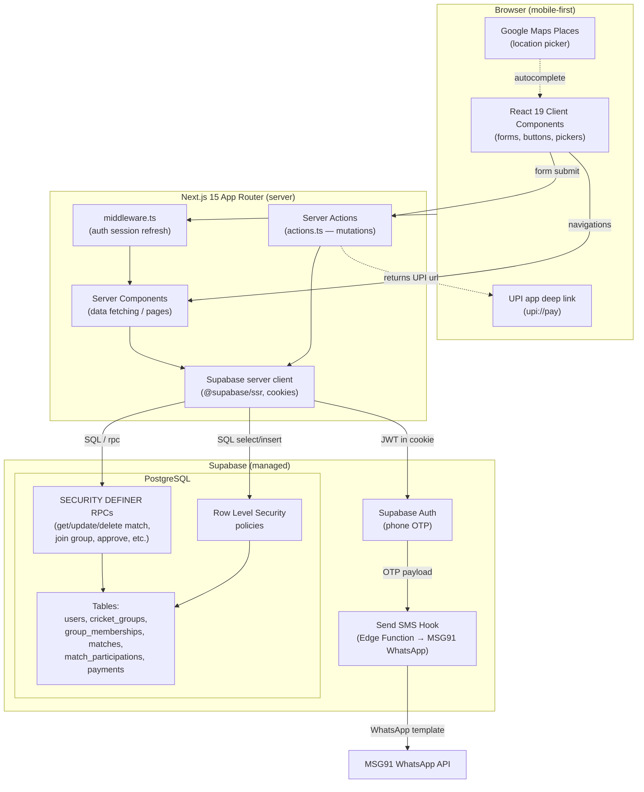
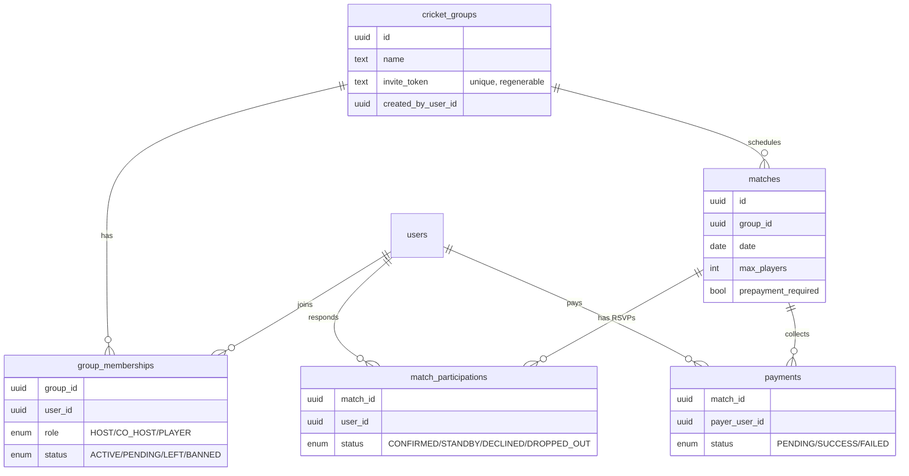

# CricScheduler — Architecture

A mobile-first web app for amateur cricket groups to schedule matches, track
availability (RSVP), and collect optional UPI prepayments. It is a full-stack
Next.js app talking directly to Supabase — there is no separate API server,
ORM, or client state-management library.

## Tech stack

| Layer | Technology |
|-------|------------|
| Frontend | Next.js 15 (App Router), React 19, TypeScript 5.8, Tailwind CSS 4 |
| Backend | Next.js Server Components + Server Actions |
| Auth | Supabase Auth (passwordless OTP) via `@supabase/ssr` (cookie sessions); **email OTP** (Supabase) and **phone OTP delivered over WhatsApp** via MSG91 through a Supabase Send SMS Hook (Edge Function) |
| Database | Supabase PostgreSQL with Row Level Security + SECURITY DEFINER RPCs |
| Integrations | Google Maps Places (location picker), UPI intent deep links |
| Tooling | ESLint 9, nvm, npm |

## System overview



## Request lifecycle

1. **Auth gate** — Every request passes through `src/middleware.ts`, which
   refreshes the Supabase session cookie. Pages call `requireAuth()`;
   unauthenticated users are redirected to `/auth` (with a `?next=` return path
   so invite links survive sign-in).
2. **Reads (Server Components)** — Page components create a server-side Supabase
   client and either query tables directly (guarded by RLS) or call a
   SECURITY DEFINER RPC when RLS would block or recurse.
3. **Writes (Server Actions)** — Forms/buttons call `"use server"` actions
   (`createMatch`, `updateMatch`, `deleteGroup`, `requestToJoinGroup`,
   `approveJoinRequest`, …) which run RPCs/queries, then `revalidatePath` +
   `redirect`.

## Why so many RPCs

The `matches` and `match_participations` RLS policies reference each other,
which produced **"infinite recursion detected in policy for relation matches"**.
The fix (migration `010`) and the broader pattern is to use
**`SECURITY DEFINER` functions** that run with elevated privileges and perform
their own explicit permission checks (creator / host / co-host). This avoids the
RLS recursion while keeping access control enforced in one place.

Representative RPCs:

- `get_match_for_user`, `get_group_upcoming_matches` — reads
- `update_match_for_user`, `delete_match_for_user` — match mutations
- `delete_group_for_user`, `regenerate_group_invite` — group mutations
- `get_group_by_invite_token`, `request_to_join_group`,
  `get_pending_join_requests`, `approve_join_request`, `deny_join_request` —
  invite / join flow

## External touchpoints (client-side only)

- **Google Maps Places** runs in the browser to pick a match location and
  capture name/address/maps link.
- **UPI payment** is a `upi://pay?...` deep link to the **match host's UPI ID**
  (`host_upi_vpa`, set when creating/editing a match with prepayment enabled).
  There is **no payment gateway**; the host **manually verifies** payment and the
  server action updates the `payments` row, which in turn confirms the spot.

## Data model



Notes:
- `cricket_groups` is named to avoid the reserved word `groups` in
  PostgREST/Supabase.
- Foreign keys use `ON DELETE CASCADE`, so deleting a group removes its matches,
  memberships, participations and payments.

## Key flows

### Group invite + join (link + host approval)

WhatsApp membership cannot be verified programmatically (no API), so the link is
the entry point and the **host approves each request**:

1. Host shares `/{origin}/groups/join/<invite_token>` inside the WhatsApp group.
2. Visitor signs in (redirected back via `?next=`), sees group info, and clicks
   **Request to join** → `request_to_join_group` creates a `PENDING` membership.
3. Host sees pending requests on the group page and **Approves** (→ `ACTIVE`) or
   **Denies** (request removed). Token can be regenerated to revoke old links.

### RSVP + payment

- No prepayment: **Confirm Spot** → `CONFIRMED` (or **Standby** if full).
- Prepayment required: **Pay & Confirm** → creates `PENDING` payment, holds spot
  as `STANDBY`, opens UPI app. Host verifies payment → `CONFIRMED`.

## Project layout

```
src/
  app/
    auth/                      Phone OTP sign in/up (+ next redirect)
    groups/                    List, create, detail, join
      [groupId]/               Group detail, matches/new
      join/[token]/            Invite landing + request to join
      actions.ts               Group + invite server actions
    matches/
      [matchId]/               Match detail, edit, manage
      actions.ts               RSVP, payment, edit/delete server actions
  components/                  UI + feature components
  lib/
    supabase/                  server/middleware clients
    auth.ts                    requireAuth / getCurrentUser
    match-logic.ts             role + RSVP helpers
    phone.ts                   E.164 phone normalize/validate
    utils.ts                   formatting, UPI URL builder
supabase/migrations/           001–022 SQL migrations (schema, RLS, RPCs)
supabase/functions/sms-hook/   Send SMS Hook Edge Function (WhatsApp via MSG91)
```

## Local development

```bash
nvm use
npm install
npm run dev          # http://localhost:3000
npm run dev:clean    # clears .next cache first (use if stale-chunk errors)
```

Do not run `npm run build` while `npm run dev` is running — it can corrupt the
shared `.next` cache and cause 404/500s until cleared.

## Sign-in methods

Two passwordless OTP methods, both backed by Supabase (which owns OTP generation,
validation, and sessions):

- **Email OTP** — `signInWithOtp({ email })` / `verifyOtp({ type: "email" })`.
  Delivered by Supabase's email (built-in sender; configure custom SMTP for
  production volume).
- **Phone OTP** — delivered over **WhatsApp via MSG91** (see below).

Both methods are live in **all environments** via the `methods` prop in
`src/app/auth/page.tsx` (`{ email: true, phone: "whatsapp" }`), so the sign-in
form shows an **Email / Phone** toggle where the phone option sends only over
WhatsApp. **SMS is not offered as a user-facing sign-in option** (`PhoneMode` is
`false | "whatsapp"`). Email and phone are separate Supabase identities (no
linking yet).

## OTP delivery (WhatsApp via MSG91)

Supabase generates and validates the OTP; delivery is customized via the
**Send SMS Hook**. When a phone OTP is requested, Supabase POSTs a signed payload
(`user.phone`, `sms.otp`) to the `sms-hook` Edge Function
(`supabase/functions/sms-hook/index.ts`), which sends the code over **WhatsApp**
using MSG91's WhatsApp API and an approved **authentication template**. Supabase
still owns OTP validation (`verifyOtp`) and session creation — only the delivery
channel is swapped, so no custom auth is needed. WhatsApp is not subject to
Indian DLT/SMS registration.

The client always requests Supabase's `sms` channel (in every environment) —
that's what fires the Send SMS Hook; the `whatsapp` channel would bypass the
hook and use Supabase's native provider. The sign-in form's copy says WhatsApp
because that's the actual delivery channel.

### Testing phone OTP locally

For day-to-day local testing, skip the provider entirely using Supabase
**test phone numbers** (fixed codes that never hit MSG91):

1. Supabase Dashboard → **Authentication → Sign In / Providers → Phone** (ensure
   the Phone provider is enabled).
2. In the **Test OTP** section, add a mapping, e.g. phone `+919876543210` →
   code `123456`. (Self-hosted/CLI equivalent: the `[auth.sms.test_otp]` block
   in `supabase/config.toml`.)
3. In the sign-in form, enter that number, send a code (the hook is not called
   for test numbers), then verify with the static code.

The phone method shows a single **WhatsApp** button in all environments
(`phone: "whatsapp"`); there is no SMS button. Test phone numbers still work for
exercising the flow without sending a real WhatsApp message.

### Testing email OTP locally

Enable **Auth → Providers → Email** and use the built-in Supabase sender (no SMTP
needed for testing, but it's hard-locked at **2 emails/hour** until you configure
custom SMTP — see [Rate limits](#rate-limits)). Ensure the email OTP template
includes `{{ .Token }}` so a 6-digit code is sent. Then use the form's **Email**
method, request a code, and verify. For higher volume or real delivery, configure
custom SMTP (see the deployment checklist).

### Real delivery (validating MSG91)

Deploy the Edge Function and enable the hook (see deployment below). You need:

- A **WhatsApp Business number** registered on MSG91 (the "integrated number").
- An approved WhatsApp **authentication template** (one OTP body variable plus a
  copy-code button).
- `MSG91_AUTHKEY` and the template name/language set as Edge Function secrets.

Check **Edge Functions → sms-hook → Logs** and the MSG91 dashboard if a code
doesn't arrive.

## Rate limits

**Both** sign-in methods are rate-limited by Supabase Auth — WhatsApp/phone is
_not_ unlimited. The important difference is what you can change and where:

- **Email (built-in sender)** — hard-locked at **2 emails/hour, project-wide**.
  This cannot be raised in the dashboard; the only way to change it is to
  configure **custom SMTP** (or a Send Email hook). Custom SMTP starts at
  30/hour and is then adjustable under **Auth → Rate Limits**.
- **Phone / WhatsApp** — the request goes through Supabase's phone OTP endpoint
  (`/auth/v1/otp`, `sms` channel) _before_ the MSG91 hook is called, so Supabase
  limits apply first:
  - **30 OTPs/hour, project-wide** (default; `rate_limit_otp`) — **adjustable
    now** in **Auth → Rate Limits** (no SMTP needed, since the phone provider is
    enabled).
  - **60-second per-user cooldown** between OTP requests to the same number
    (adjustable).
  - `rate_limit_sms_sent` also applies.

Two caveats: (1) the 30 OTPs/hour bucket is **shared project-wide across email
and phone OTP** requests, so heavy email testing eats into the same allowance;
(2) **MSG91 has its own WhatsApp quotas/throughput** limits, independent of
Supabase — check your MSG91 plan for launch volumes.

## Deployment

The app is **two managed pieces**: the Next.js frontend (any Node host) and
Supabase (database + auth). Supabase does **not** host the Next.js app, so a
"100% Supabase" deployment isn't possible without rewriting the app as a static
SPA — keep them separate.

**Recommended: Vercel (frontend) + Supabase (backend).** Vercel is built by the
Next.js team and supports App Router, Server Actions, middleware, and image
optimization with zero config. DigitalOcean App Platform is a fine alternative
(predictable flat pricing, full Node support); Heroku works but is the weakest
fit and has no free tier.

### Deploy to Vercel

1. Push to GitHub (already done), then **New Project** in Vercel and import the
   repo. Vercel auto-detects Next.js — no build config needed.
2. Add the environment variables below (Project → Settings → Environment
   Variables) for the Production (and Preview) environments.
3. Deploy. Vercel gives you a `*.vercel.app` URL; add a custom domain later if
   desired.

### Required environment variables

| Variable | Where | Notes |
|----------|-------|-------|
| `NEXT_PUBLIC_SUPABASE_URL` | client + server | Supabase project URL |
| `NEXT_PUBLIC_SUPABASE_PUBLISHABLE_KEY` | client + server | Supabase publishable (anon) key |
| `NEXT_PUBLIC_GOOGLE_MAPS_API_KEY` | client | Maps Places (restrict by HTTP referrer) |
| `NEXT_PUBLIC_APP_NAME` | client | App display name in UPI pay links (e.g. CricScheduler) |
| `NEXT_PUBLIC_RECAPTCHA_SITE_KEY` | client | reCAPTCHA v3 site key |
| `RECAPTCHA_SECRET_KEY` | server only | reCAPTCHA v3 secret key |
| `RECAPTCHA_MIN_SCORE` | server only | Min score to accept (default 0.5); captcha is skipped if keys are unset |

See `.env.example` for the authoritative list.

### Post-deploy checklist

1. **Supabase Auth → URL Configuration**: set the **Site URL** to your
   production domain and add it (plus `*.vercel.app` preview URLs) to **Redirect
   URLs**, so OTP/auth redirects work in production. Add both apex and `www` if
   you serve both (e.g. `https://cricscheduler.com/**` and
   `https://www.cricscheduler.com/**`). Prefer one **canonical** URL in Site URL;
   auth cookies are scoped to `.cricscheduler.com` so sessions work on both.
2. **Run migrations** against the production database: apply
   `supabase/migrations/001`–`022` (Supabase SQL Editor or `supabase db push`).
   After DDL changes, run `NOTIFY pgrst, 'reload schema';`.
3. **reCAPTCHA**: add the production domain to the allowed domains in the
   reCAPTCHA admin console.
4. **Google Maps**: add the production domain to the API key's HTTP referrer
   restrictions.
5. **WhatsApp OTP (MSG91)**: deploy the hook
   (`npx supabase functions deploy sms-hook --no-verify-jwt`), set its secrets
   (`SEND_SMS_HOOK_SECRET`, `MSG91_AUTHKEY`, `MSG91_WA_INTEGRATED_NUMBER`,
   `MSG91_WA_TEMPLATE_NAME`, optional `MSG91_WA_TEMPLATE_LANG`), and enable
   **Auth → Hooks → Send SMS** (HTTPS →
   `https://<project-ref>.supabase.co/functions/v1/sms-hook`). Confirm the MSG91
   WhatsApp number and authentication template are approved for live use.
   WhatsApp is enabled in all environments via the `methods` prop in
   `src/app/auth/page.tsx`.
6. **Email OTP**: enable **Auth → Providers →
   Email**, and ensure the email OTP template includes the `{{ .Token }}` code
   (not only `{{ .ConfirmationURL }}`) so users receive a 6-digit code.
   **Configure custom SMTP** under **Auth → SMTP Settings** — the built-in
   Supabase sender is rate-limited (~a few/hour) and for testing only.
   Recommended transactional providers (free tiers): **Resend** (~3k/mo,
   simplest), **Brevo** (300/day), **SendGrid** (100/day), or **AWS SES** (cheap
   at scale). Verify your sending domain (SPF/DKIM) for inbox placement. Avoid
   personal Gmail SMTP in production: ~500/day cap, forced From address, and poor
   deliverability for transactional mail.
