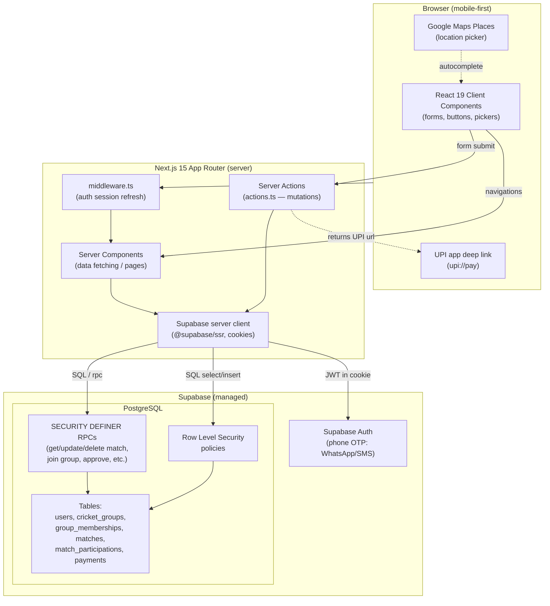
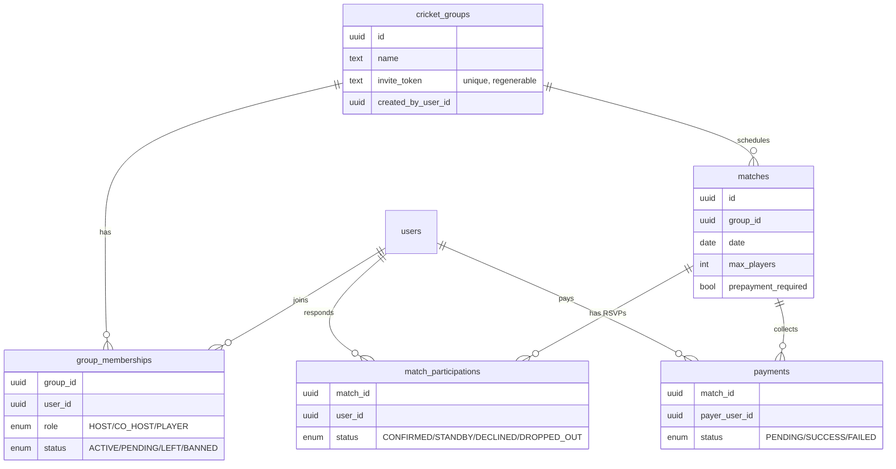

# CricScheduler — Architecture

A mobile-first web app for amateur cricket groups to schedule matches, track
availability (RSVP), and collect optional UPI prepayments. It is a full-stack
Next.js app talking directly to Supabase — there is no separate API server,
ORM, or client state-management library.

## Tech stack

| Layer | Technology |
|-------|------------|
| Frontend | Next.js 15 (App Router), React 19, TypeScript 5.8, Tailwind CSS 4 |
| Backend | Next.js Server Components + Server Actions |
| Auth | Supabase Auth (phone OTP via WhatsApp/SMS, Twilio Verify) via `@supabase/ssr` (cookie sessions) |
| Database | Supabase PostgreSQL with Row Level Security + SECURITY DEFINER RPCs |
| Integrations | Google Maps Places (location picker), UPI intent deep links |
| Tooling | ESLint 9, nvm, npm |

## System overview



## Request lifecycle

1. **Auth gate** — Every request passes through `src/middleware.ts`, which
   refreshes the Supabase session cookie. Pages call `requireAuth()`;
   unauthenticated users are redirected to `/auth` (with a `?next=` return path
   so invite links survive sign-in).
2. **Reads (Server Components)** — Page components create a server-side Supabase
   client and either query tables directly (guarded by RLS) or call a
   SECURITY DEFINER RPC when RLS would block or recurse.
3. **Writes (Server Actions)** — Forms/buttons call `"use server"` actions
   (`createMatch`, `updateMatch`, `deleteGroup`, `requestToJoinGroup`,
   `approveJoinRequest`, …) which run RPCs/queries, then `revalidatePath` +
   `redirect`.

## Why so many RPCs

The `matches` and `match_participations` RLS policies reference each other,
which produced **"infinite recursion detected in policy for relation matches"**.
The fix (migration `010`) and the broader pattern is to use
**`SECURITY DEFINER` functions** that run with elevated privileges and perform
their own explicit permission checks (creator / host / co-host). This avoids the
RLS recursion while keeping access control enforced in one place.

Representative RPCs:

- `get_match_for_user`, `get_group_upcoming_matches` — reads
- `update_match_for_user`, `delete_match_for_user` — match mutations
- `delete_group_for_user`, `regenerate_group_invite` — group mutations
- `get_group_by_invite_token`, `request_to_join_group`,
  `get_pending_join_requests`, `approve_join_request`, `deny_join_request` —
  invite / join flow

## External touchpoints (client-side only)

- **Google Maps Places** runs in the browser to pick a match location and
  capture name/address/maps link.
- **UPI payment** is a `upi://pay?...` deep link handed to the user's UPI app.
  There is **no payment gateway**; the host **manually verifies** payment and the
  server action updates the `payments` row, which in turn confirms the spot.

## Data model



Notes:
- `cricket_groups` is named to avoid the reserved word `groups` in
  PostgREST/Supabase.
- Foreign keys use `ON DELETE CASCADE`, so deleting a group removes its matches,
  memberships, participations and payments.

## Key flows

### Group invite + join (link + host approval)

WhatsApp membership cannot be verified programmatically (no API), so the link is
the entry point and the **host approves each request**:

1. Host shares `/{origin}/groups/join/<invite_token>` inside the WhatsApp group.
2. Visitor signs in (redirected back via `?next=`), sees group info, and clicks
   **Request to join** → `request_to_join_group` creates a `PENDING` membership.
3. Host sees pending requests on the group page and **Approves** (→ `ACTIVE`) or
   **Denies** (request removed). Token can be regenerated to revoke old links.

### RSVP + payment

- No prepayment: **Confirm Spot** → `CONFIRMED` (or **Standby** if full).
- Prepayment required: **Pay & Confirm** → creates `PENDING` payment, holds spot
  as `STANDBY`, opens UPI app. Host verifies payment → `CONFIRMED`.

## Project layout

```
src/
  app/
    auth/                      Phone OTP sign in/up (+ next redirect)
    groups/                    List, create, detail, join
      [groupId]/               Group detail, matches/new
      join/[token]/            Invite landing + request to join
      actions.ts               Group + invite server actions
    matches/
      [matchId]/               Match detail, edit, manage
      actions.ts               RSVP, payment, edit/delete server actions
  components/                  UI + feature components
  lib/
    supabase/                  server/middleware clients
    auth.ts                    requireAuth / getCurrentUser
    match-logic.ts             role + RSVP helpers
    phone.ts                   E.164 phone normalize/validate
    utils.ts                   formatting, UPI URL builder
supabase/migrations/           001–015 SQL migrations (schema, RLS, RPCs)
```

## Local development

```bash
nvm use
npm install
npm run dev          # http://localhost:3000
npm run dev:clean    # clears .next cache first (use if stale-chunk errors)
```

Do not run `npm run build` while `npm run dev` is running — it can corrupt the
shared `.next` cache and cause 404/500s until cleared.

## Deployment

The app is **two managed pieces**: the Next.js frontend (any Node host) and
Supabase (database + auth). Supabase does **not** host the Next.js app, so a
"100% Supabase" deployment isn't possible without rewriting the app as a static
SPA — keep them separate.

**Recommended: Vercel (frontend) + Supabase (backend).** Vercel is built by the
Next.js team and supports App Router, Server Actions, middleware, and image
optimization with zero config. DigitalOcean App Platform is a fine alternative
(predictable flat pricing, full Node support); Heroku works but is the weakest
fit and has no free tier.

### Deploy to Vercel

1. Push to GitHub (already done), then **New Project** in Vercel and import the
   repo. Vercel auto-detects Next.js — no build config needed.
2. Add the environment variables below (Project → Settings → Environment
   Variables) for the Production (and Preview) environments.
3. Deploy. Vercel gives you a `*.vercel.app` URL; add a custom domain later if
   desired.

### Required environment variables

| Variable | Where | Notes |
|----------|-------|-------|
| `NEXT_PUBLIC_SUPABASE_URL` | client + server | Supabase project URL |
| `NEXT_PUBLIC_SUPABASE_PUBLISHABLE_KEY` | client + server | Supabase publishable (anon) key |
| `NEXT_PUBLIC_GOOGLE_MAPS_API_KEY` | client | Maps Places (restrict by HTTP referrer) |
| `NEXT_PUBLIC_UPI_MERCHANT_VPA` | client | Host UPI VPA used to build `upi://pay` links |
| `NEXT_PUBLIC_APP_NAME` | client | App display name (e.g. CricScheduler) |
| `NEXT_PUBLIC_RECAPTCHA_SITE_KEY` | client | reCAPTCHA v3 site key |
| `RECAPTCHA_SECRET_KEY` | server only | reCAPTCHA v3 secret key |
| `RECAPTCHA_MIN_SCORE` | server only | Min score to accept (default 0.5); captcha is skipped if keys are unset |

See `.env.example` for the authoritative list.

### Post-deploy checklist

1. **Supabase Auth → URL Configuration**: set the **Site URL** to your
   production domain and add it (plus `*.vercel.app` preview URLs) to **Redirect
   URLs**, so OTP/auth redirects work in production.
2. **Run migrations** against the production database: apply
   `supabase/migrations/001`–`015` (Supabase SQL Editor or `supabase db push`).
3. **reCAPTCHA**: add the production domain to the allowed domains in the
   reCAPTCHA admin console.
4. **Google Maps**: add the production domain to the API key's HTTP referrer
   restrictions.
5. **Twilio Verify** (phone OTP): confirm the WhatsApp/SMS sender and Verify
   service are live (not in trial/sandbox) for real users.
